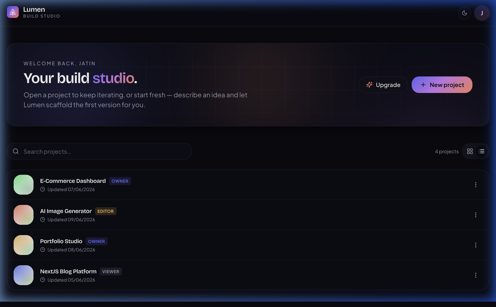
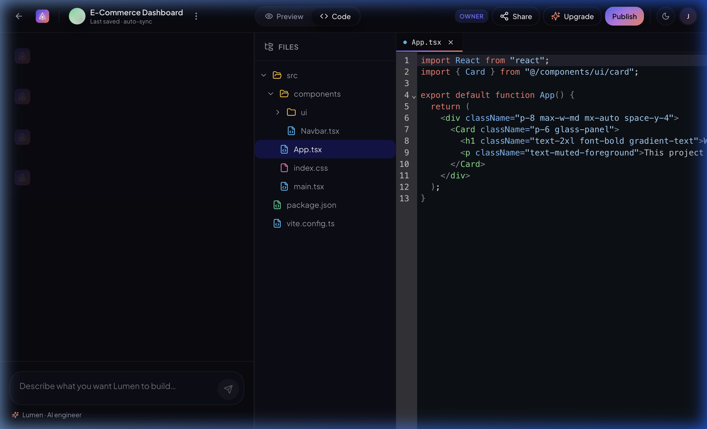
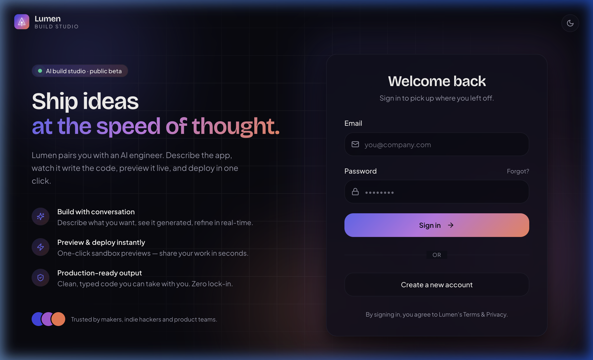
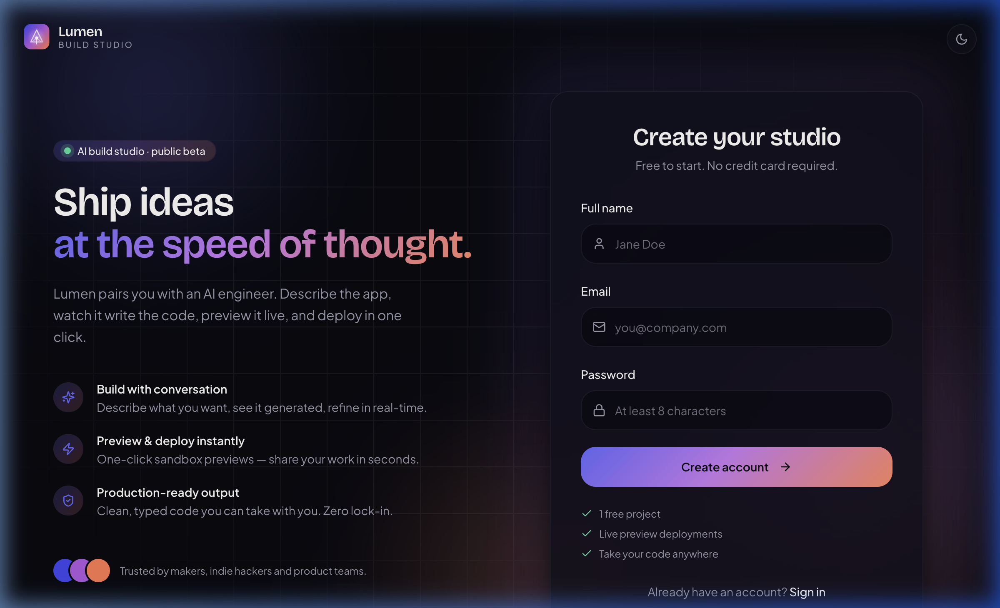
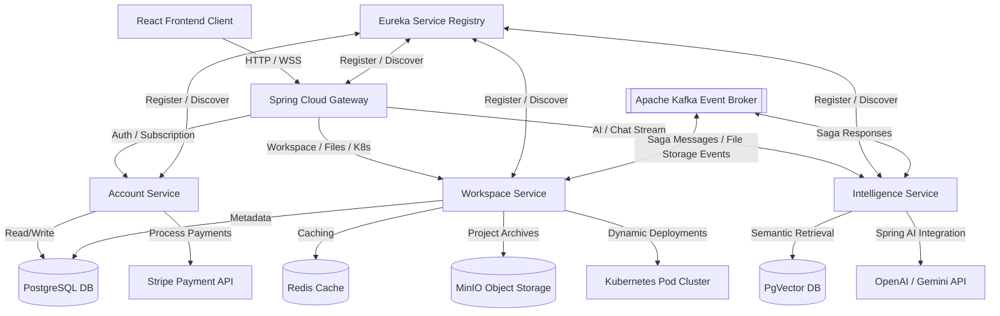

#  Lumen — AI-Powered Distributed Build Studio & IDE

Lumen is a state-of-the-art, AI-driven development studio (a distributed replica of [Lovable.dev](https://lovable.dev)). It empowers developers to build, iterate, preview, and deploy React web applications entirely through conversational prompts. 

This repository houses the entire distributed system, comprising a high-fidelity, glassmorphic **React + TypeScript + Tailwind** frontend SPA and an event-driven, production-ready **Spring Boot microservices** backend orchestrating AI prompt generation, file tree management, workspace collaboration, and dynamic deployments onto Kubernetes.

---

##  Visual Walkthrough

###  1. The Build Studio Dashboard
The landing page greets you with an elegant aurora background that flows into the **Lumen Workspace Dashboard**. From here, you can view your active projects, create a new project scaffolding, track billing upgrades, or search your existing workspace library.



###  2. The Interactive IDE & AI Chat Workspace
Selecting a project loads the **AI Build Workspace**. It features a side-by-side interactive IDE layout containing:
- **Left Panel:** Streaming AI Chat Assistant where you describe changes or new elements.
- **Center Panel:** Code Editor powered by CodeMirror, displaying the hot-reloaded active files.
- **Right Panel:** Sandboxed web preview loading the live built application.
- **File Explorer:** An interactive tree structure of your react workspace.



###  3. Authentication & Onboarding
Lumen comes equipped with a modern, glassmorphic login and signup experience utilizing floating glass panels, customized input validations, and animated layout transitions.

| Login Studio | Account Setup |
| :---: | :---: |
|  |  |

---

##  System Architecture

Lumen uses a microservices-based, event-driven architecture designed to scale seamlessly. 



### Backend Microservices Core
- **`api-gateway` (Spring Cloud Gateway):** Single entry point handling routing, rate limiting, CORS configuration, and token propagation.
- **`discovery-service` (Spring Cloud Netflix Eureka):** Registry allowing microservices to discover and load-balance calls dynamically.
- **`config-service` (Spring Cloud Config):** Centralized cloud configuration repository for all environments.
- **`account-service`:** Handles authentication (JWT), user profile registration, role-based access control, and billing subscription tiers (linked with Stripe billing portals).
- **`workspace-service`:** Manages files and directory nodes, processes project templates, handles collaboration membership (inviting teammates and assigning roles), and deploys generated projects dynamically onto Kubernetes.
- **`intelligence-service`:** Orchestrates prompt context assembly, tracks API token metrics, manages session histories, and uses **Spring AI** (`spring-ai-bom` 2.0.0-M2) with LLMs (e.g., GPT, Claude, Gemini) to generate full code outputs.
- **`common-lib`:** Core shared Java library storing request/response DTOs, global exceptions, and security classes.

---

##  Tech Stack & Dependencies

### Frontend
* **Core Framework:** React 18, TypeScript, Vite, React Router DOM v6
* **State & Data Fetching:** React Query (TanStack)
* **Styling & UI:** Tailwind CSS, Shadcn UI, Radix UI primitive components, Lucide Icons
* **Rich Interactions:** CodeMirror (with Javascript/JSON/CSS syntax highlighters), React Markdown, Recharts

### Backend
* **Java Version:** JDK 21
* **Framework:** Spring Boot 4.0.3, Spring Cloud (2025.1.0)
* **AI Integration:** Spring AI (Prompts, System Messages, streaming chat controllers)
* **Transaction Pattern:** Saga orchestration pattern over Kafka for cross-service workflows.
* **ORM & Database:** Spring Data JPA, PostgreSQL (with PgVector)
* **Payment Integration:** Stripe Java SDK

### Infrastructure & Operations
* **Message Broker:** Apache Kafka & ZooKeeper
* **Object Store:** MinIO (S3-compatible Object Storage for saving project ZIPs)
* **Cache & Session:** Redis Key-Value Store
* **Containerization:** Jib Maven Plugin (for building Docker images without a Docker daemon)
* **Orchestration:** Kubernetes Deployment manifests, ClusterIP Service configurations

---

##  Running the Project Locally

### Prerequisites
1. **Node.js** (v18+) & **npm / Bun**
2. **Java JDK 21**
3. **Docker & Docker Compose**
4. **Kubernetes Environment** (e.g., Docker Desktop Kubernetes, Minikube) - optional for deployment features.

### Step 1: Spin Up Infrastructure
Start databases, Kafka, and MinIO storage containers using Docker Compose in the backend directory:
```sh
cd backend-lumne
docker-compose up -d
```

### Step 2: Build the Backend Services
Install and package the Spring Boot services. Ensure `common-lib` is built first:
```sh
cd common-lib
mvn clean install

# Build other backend microservices
cd ../account-service && ./mvnw clean package -DskipTests
cd ../workspace-service && ./mvnw clean package -DskipTests
cd ../intelligence-service && ./mvnw clean package -DskipTests
cd ../api-gateway && ./mvnw clean package -DskipTests
cd ../discovery-service && ./mvnw clean package -DskipTests
cd ../config-service && ./mvnw clean package -DskipTests
```

### Step 3: Run the Services
Run each service either through your IDE or directly using the Spring Boot plugin. Run them in the following logical order:
1. `config-service` (Wait for it to boot)
2. `discovery-service` (Eureka Registry)
3. `api-gateway` (Gateway Router)
4. `account-service`, `workspace-service`, `intelligence-service`

```sh
# Example starting the discovery registry
cd discovery-service
./mvnw spring-boot:run
```

### Step 4: Run the Frontend Studio
Install node dependencies and start the Vite development server:
```sh
cd ../frontend-lumen
npm install
npm run dev
```
Open **[http://localhost:3000](http://localhost:3000)** in your browser.

---

##  Kubernetes Deployment

Lumen components are containerized using Google's **Jib plugin** and deployed to Kubernetes.
All service manifests (e.g., [frontend.yaml](backend-lumne/k8s/services/frontend.yaml)) are located under the `backend-lumne/k8s/` folder.

To deploy the core services to your Kubernetes cluster:
```sh
kubectl apply -f backend-lumne/k8s/infra/
kubectl apply -f backend-lumne/k8s/stateful/
kubectl apply -f backend-lumne/k8s/services/
```
